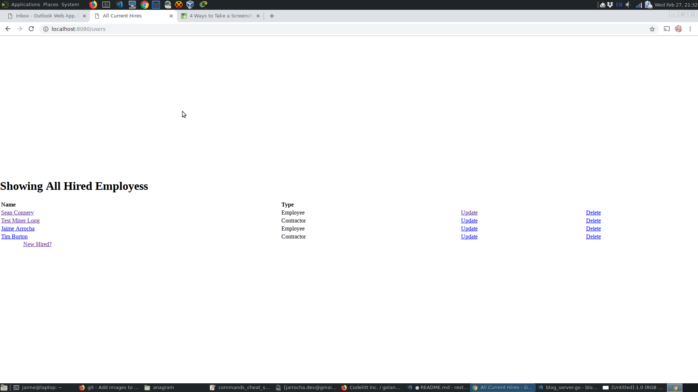
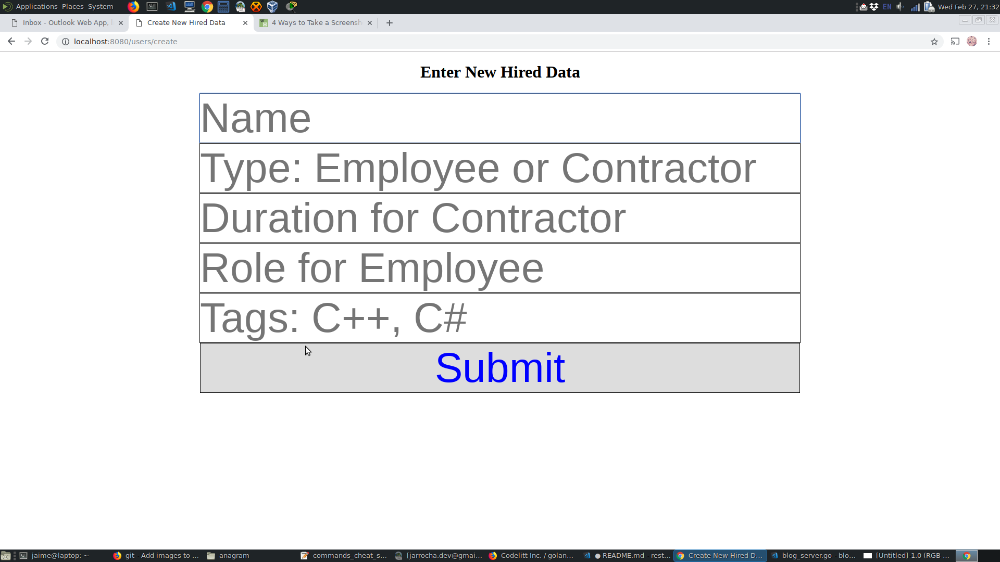

# rest-crud
A REST API with a mongoDB backend 

## Motivation

This is a small project where a RESTful CRUD API is demonstrated. The database in use is MongoDB and 
the multiplexer in use is from the Golang library. This project was built with Golang templates so as
to offer an experience not requiring an external client.

## Installation

Run the makefile included as "make install" to run.

## Test

Run the makefile included as "make test" to run some tests.

## Run

Run the output binary and open a web browser or do "make run", then go to [localhost:8080](https://localhost:8080).

## Images

